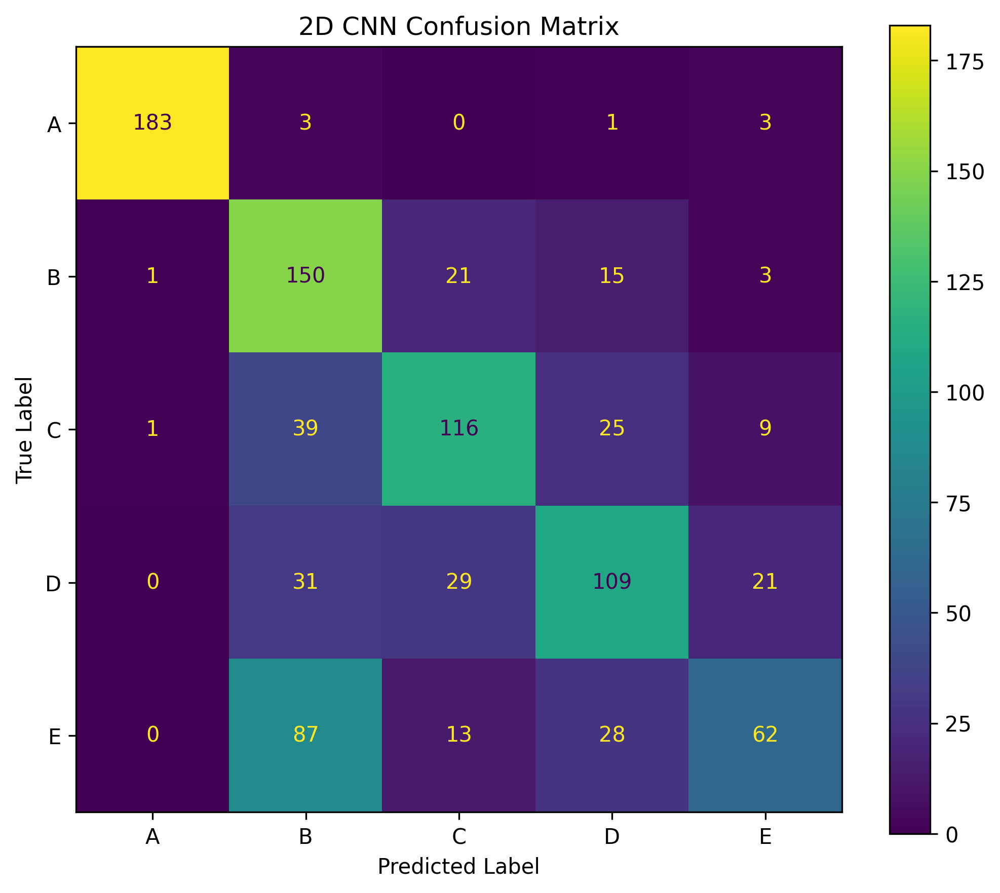
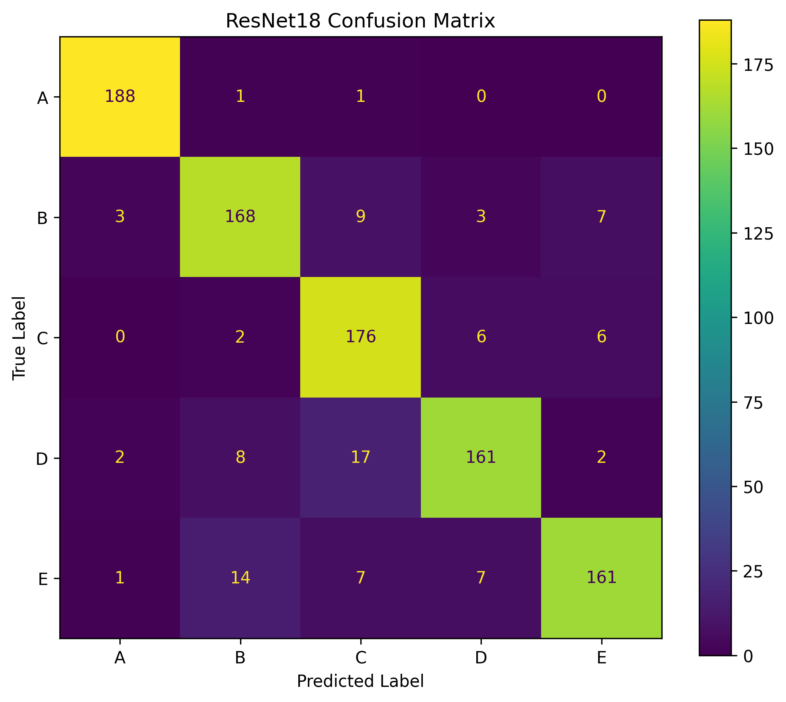
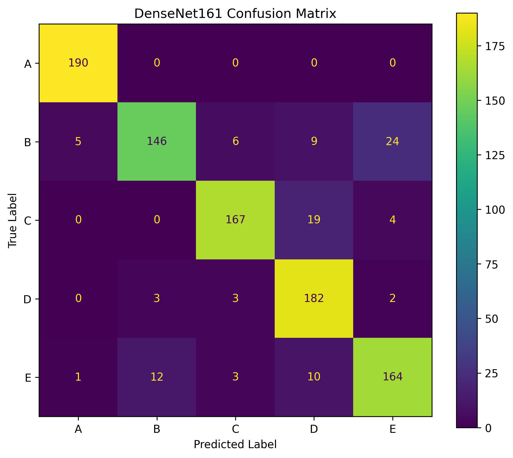

# AI 모델 재현 및 성능 비교 과제

## 1. 코드 설명

본 과제에서는 문손잡이 회전 과정에서 측정한 손바닥 sEMG 신호를 이용하여 사용자 A~E를 식별하는 모델을 구현하였다.

### 사용 데이터 및 전처리 방법

- 사용자 수: 5명 (A~E)
- 사용자별 trial 수: 50개
- 전체 trial 수: 250개
- Sampling rate: 1000 Hz
- sEMG channel: 2개

전처리 과정은 다음과 같다.

1. 60 Hz Notch Filter
2. 20~499 Hz Band-pass Filter
3. 300 ms Sliding Window
4. 50% Overlap
5. Min-Max Normalization
6. CWT 변환
   - Morlet Wavelet
   - Scale 1~32
7. 최종 입력 형태: `(3, 32, 300)`

데이터 누수를 방지하기 위해 window를 생성하기 전에 trial 파일 단위로 Train/Test 데이터를 분할하였다.

- Train: 200 trials / 3800 windows
- Test: 50 trials / 950 windows

### 사용한 AI/ML 모델

다음 3개의 모델을 비교하였다.

- 2D CNN
- ResNet18
- DenseNet161

모든 모델은 동일한 Train/Test 데이터와 동일한 학습 조건을 사용하였다.

- Epoch: 45
- Batch Size: 16
- Optimizer: Adam
- Learning Rate: 0.001
- Loss Function: CrossEntropyLoss
- Pretrained Weight: 사용하지 않음

### 학습 및 테스트 방법

각 모델은 동일한 Train/Test split에서 총 3회 독립적으로 학습하였다.

최종 성능은 3회 실행 결과의 평균 Accuracy, Precision, Recall, F1-score를 이용하여 비교하였다.

DenseNet161에 대해서는 추가로 5-Fold Cross Validation을 수행하였다.

### 실행 방법

본 프로젝트는 Google Colab 환경에서 실행하였다.

노트북의 셀을 위에서부터 순서대로 실행하면 다음 과정이 수행된다.

```text
1. 데이터 불러오기
2. Train/Test trial 단위 분할
3. 필터링
4. Sliding Window 생성
5. Min-Max Normalization
6. CWT 변환
7. 모델 학습
8. 테스트 평가
9. Confusion Matrix 생성
10. 5-Fold Cross Validation
11. 계산 비용 측정
```

### 코드 설명

| 파일 | 설명 |
|---|---|
| `semg_project.ipynb` | 데이터 전처리, CWT 변환, 모델 학습 및 평가 전체 과정 |
| `results_summary.json` | 모델별 성능 및 계산 비용 결과 저장 |
| `confusion_densenet.png` | DenseNet161 Confusion Matrix |
| `confusion_resnet18.png` | ResNet18 Confusion Matrix |
| `confusion_2dcnn.png` | 2D CNN Confusion Matrix |

---

## 2. 모델 성능 비교

각 모델을 동일 조건에서 3회 학습한 후 평균 성능을 비교하였다.

| Model | Accuracy | Precision | Recall | F1-score |
|---|---:|---:|---:|---:|
| 2D CNN | 63.23% | 65.29% | 63.23% | 62.95% |
| ResNet18 | **87.79%** | **88.19%** | **87.79%** | **87.71%** |
| DenseNet161 | 87.44% | 88.17% | 87.45% | 87.34% |

### 성능 분석

3회 실행 평균 기준으로 ResNet18이 가장 높은 Accuracy와 F1-score를 기록하였다.

ResNet18의 평균 Accuracy는 87.79%, DenseNet161은 87.44%로 두 모델의 차이는 약 0.35%p로 매우 작았다.

2D CNN은 평균 Accuracy 63.23%로 다른 두 모델보다 낮은 성능을 보였다.

또한 DenseNet161의 5-Fold Cross Validation 결과는 다음과 같다.

```text
Fold 1: 87.47%
Fold 2: 89.05%
Fold 3: 87.16%
Fold 4: 88.32%
Fold 5: 89.37%

평균: 88.27 ± 0.86%
```

각 Fold의 성능 차이가 크지 않아 데이터 분할에 따른 성능 변동은 비교적 작은 것으로 나타났다.

---

## 3. Confusion Matrix 분석

## 3.1 2D CNN



대표 실행의 Confusion Matrix:

```text
[[183,   3,   0,   1,   3],
 [  1, 150,  21,  15,   3],
 [  1,  39, 116,  25,   9],
 [  0,  31,  29, 109,  21],
 [  0,  87,  13,  28,  62]]
```

### 분석

- 가장 잘 분류된 클래스: **A**
- 가장 많이 오분류된 클래스: **E**
- 주요 오분류 유형: **E → B (87개)**
- 오분류가 발생한 이유에 대한 분석:
  - 2D CNN은 구조가 단순하여 사용자별 sEMG 시간-주파수 특징을 충분히 구분하지 못한 것으로 볼 수 있다.
  - 특히 E 클래스의 특징이 B 클래스와 일부 유사하게 표현되었을 가능성이 있다.

---

## 3.2 ResNet18



대표 실행의 Confusion Matrix:

```text
[[188,   1,   1,   0,   0],
 [  3, 168,   9,   3,   7],
 [  0,   2, 176,   6,   6],
 [  2,   8,  17, 161,   2],
 [  1,  14,   7,   7, 161]]
```

### 분석

- 가장 잘 분류된 클래스: **A**
- 가장 많이 오분류된 클래스: **D**
- 주요 오분류 유형: **D → C (17개)**
- 오분류가 발생한 이유에 대한 분석:
  - D와 C 클래스의 일부 sEMG 시간-주파수 특징이 비슷하게 나타났을 가능성이 있다.
  - 전체적으로는 대부분의 클래스에서 비교적 균형 잡힌 분류 성능을 보였다.

---

## 3.3 DenseNet161



대표 실행의 Confusion Matrix:

```text
[[190,   0,   0,   0,   0],
 [  5, 146,   6,   9,  24],
 [  0,   0, 167,  19,   4],
 [  0,   3,   3, 182,   2],
 [  1,  12,   3,  10, 164]]
```

### 분석

- 가장 잘 분류된 클래스: **A**
- 가장 많이 오분류된 클래스: **B**
- 주요 오분류 유형: **B → E (24개)**
- 오분류가 발생한 이유에 대한 분석:
  - 동일한 문손잡이 회전 동작을 수행하더라도 사용자별 근육 사용 패턴이 일부 겹칠 수 있다.
  - B와 E의 일부 CWT 시간-주파수 패턴이 유사하게 나타났을 가능성이 있다.
  - 실제 신호 특징을 직접 비교한 것은 아니므로 해당 원인은 가능성으로 해석하였다.

---

## 4. 최종 결과

- 가장 성능이 좋은 모델: **ResNet18**
- 가장 성능이 낮은 모델: **2D CNN**
- 주요 오분류 클래스:
  - 2D CNN: E → B
  - ResNet18: D → C
  - DenseNet161: B → E

### 전체적인 실험 결과 및 느낀 점

3회 실행 평균 기준으로 ResNet18이 87.79%의 Accuracy와 87.71%의 F1-score를 기록하여 가장 높은 성능을 보였다.

DenseNet161은 87.44%의 Accuracy와 87.34%의 F1-score를 기록하여 ResNet18과 매우 유사한 성능을 보였다.

반면 2D CNN은 63.23%의 Accuracy를 기록하여 상대적으로 낮은 성능을 나타냈다.

계산 비용을 비교했을 때 ResNet18은 DenseNet161보다 적은 파라미터 수와 짧은 학습 및 추론 시간을 보이면서도 유사한 성능을 기록하였다.

| Model | Parameters | Training Time | Inference Time |
|---|---:|---:|---:|
| 2D CNN | 19,717 | 56.8 sec | 0.545 ± 0.054 ms |
| ResNet18 | 11,179,077 | 236.3 sec | 5.099 ± 0.828 ms |
| DenseNet161 | 26,483,045 | 1247.2 sec | 22.882 ± 4.591 ms |

따라서 본 실험에서는 단순히 모델의 깊이가 깊거나 파라미터 수가 많다고 해서 반드시 더 높은 성능을 보이는 것은 아니었으며, 분류 성능과 계산 비용을 함께 고려하는 것이 중요하다는 점을 확인하였다.
